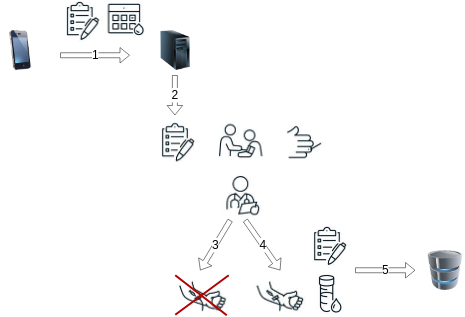

# BloodDonorApp Data Protection Impact Assessment (DPIA)

## Brief Description of the Blood Donor App Project and Data Processing Goals

The Austrian Red Cross conducts blood donations, stores, and distributes blood units to institutions which administer blood to patients.
Currently, prospect donors have to fill out a paper questionnaire which is evaluated by a doctor before being admitted to donate blood. The questionnaire contains roughly 40 questions, among others, regarding the prospect donors past and present health, regarding surgical procedures, and sexual activities, see [Blutspendedienst_Fragebogen](Blutspendedienst_Fragebogen.pdf).

When the prospect donor is admitted to donate blood, and the donated blood was administered to a patient, the questionnaire has to be kept by the Red Cross for at least 30 years, according to Austrian Law: Blutsicherheitsgesetz §11 (5).

In order to reduce waiting times for prospect donors, an app shall be implemented in which an appointment with the Red Cross venue can be arranged. Moreover the app shall allow the user to fill out the questionnaire upfront and send it to the venue along with the agreed appointment data to a dedicated Server. The doctor can then print out and evaluate the questionnaire, and on the doctors discretion, admit the donor to the donation.

As the app allows the blood donor to interrupt the filling out of the questionnaire, the already answered questions have to be stored on the cell phone in such a way that they can't be read by a another person without consent of the donor. Once the filled out questionnaire arrives at the server, care must be taken that no unauthorized personnel can access that data.

After a successful donation, and if the blood actually got administered to a patient, a Record of that questionnaire must be kept for 30 years according to the Austrian Law.

Austrian law regulates how blood donations are to be conducted in the [Blutspendeverordnung](https://www.jusline.at/gesetz/bsv)(BSV) and in the [Blutsicherheitsgesetz](https://www.jusline.at/gesetz/bsg)(BSG).

>Blutsicherheitsgesetz §11 (5): 
>(5)Die Dokumentation ist durch mindestens fünfzehn Jahre - jene Teile, die für die lückenlose Nachvollziehbarkeit der Transfusionskette unerlässlich sind durch mindestens dreißig Jahre - zur jederzeitigen Einsichtnahme durch die nach diesem Bundesgesetz zuständigen Kontrollorgane bereitzuhalten.

The process of blood donation is roughly as follows: A prospect donor uses the BloodDonorApp to arrange an appointment the Red Cross venue and to fill out the questionnaire. Both appointment and questionnaire are transmitted to a Server maintained by the Red Cross (1).

At the appointment date, the prospect donor visits the site, where the transmitted questionnaire can be printed out to a paper form (2). The heart rate, blood pressure and the hemoglobin level (and, unless already provided in a blood donor card, the blood group and Rhesus factor) of the prospect donor are taken  and written down in the paper form.

  

If the measured values are within the required boundaries, the donor then visits a doctor who checks the questionnaire and asks the prospect donor additional health related questions. Also, the prospect donor may ask questions, e.g. related to the blood donation process. If the doctor comes to the conclusion that the prospect donor is fit enough and the questionnaire did not reveal any issues preventing a donation, the prospect donor admitted to the blood donation process (4), otherwise the prospect donor cannot donate blood in the moment and is asked to visit the venue in a few weeks e.g. after enough time after a recently suffered cold has elapsed (3).

During the donation process, additional blood samples are taken for the screening of the blood; the samples are, for instance, checked for HIV, Hepatitis B/C.

If the samples did not reveal any problems, the donated blood can then be delivered to health institutions in need and eventually administered to a patent. The filled questionnaire, together with the lab results of the blood samples are then sent (in digital form?) to a long term data storage for at least 30 years as required by Austrian legislation (5).

## Description of the process activity
FIXME
- The types and amount of personal data being processed
-- Identification and contact data of the donor
-- Appointment data
-- Questionnaire answers
-- Health data and medical measurements
-- Laboratory test results
-- Donation and traceability data
- The circumstances of the processing
  
- How long the personal data will be retained,
- How the personal data will be collected, stored, accessed, shared, and ultimately destroyed 

## Description of  purpose(s):
FIXME
- Purposes for which personal data is being processed in relation to the necessity and proportionality of the processing operations 
- Details of the legal basis, such as the legitimate interest pursued by the controller

## Description of of the lawfulness of processing
FIXME
- How the processing complies with any relevant privacy or data protection principles such as purpose limitation, minimization 

## Identification of risks to the rights and freedoms of individuals (data subjects)
FIXME
- Identify the origin, nature and severity of risks caused by the processing 

## Description of measures or methods to mitigate risks, both existing and planned
FIXME
- Detailed information on the technical and organizational measures or methods envisaged to address the risks 

## Determination of the residual risks:
FIXME
- A re-evaluation of the risks, considering the measures and methods envisaged, including the residual severity

## References
https://www.jusline.at/gesetz/bsg
https://www.jusline.at/gesetz/bsv
https://www.jusline.at/gesetz/bsv/paragraf/3
https://www.ris.bka.gv.at/GeltendeFassung.wxe?Abfrage=Bundesnormen&Gesetzesnummer=10011170&FassungVom=2023-04-11
https://www.ris.bka.gv.at/GeltendeFassung.wxe?Abfrage=Bundesnormen&Gesetzesnummer=10011145&FassungVom=2023-05-10

