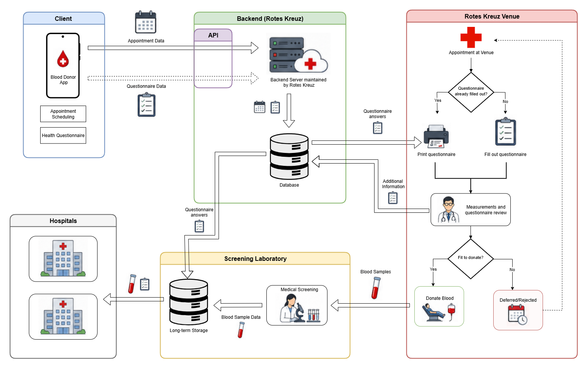

# BloodDonorApp Data Protection Impact Assessment (DPIA)

| Student | Contribution | Blood Group | Rh Factor |
|-|-|-|-|
| Stefan Ohnewith  | "Consideration about collection", "Conclusion" sections | 0 | positive |
| Ernst Schwaiger  | "Description of Blood Donor App", "References" sections | 0 | positive |
| Nermin Topalovic | "Description of Blood Donor App", "References" sections | A | positive |

## Brief Description of the Blood Donor App Project and Data Processing Goals

The Austrian Red Cross conducts blood donations, stores, and distributes blood units to institutions which administer blood to patients.
Currently, prospect donors have to fill out a paper questionnaire which is evaluated by a doctor before being admitted to donate blood. The questionnaire contains roughly 40 questions, among others, regarding the prospect donors past and present health, regarding surgical procedures, and sexual activities, see [Blutspendedienst_Fragebogen.pdf](https://www.roteskreuz.at/fileadmin/user_upload/LV/VB/Landesverband/Blutspendedienst/Blutspendedienst_Fragebogen.pdf).

When the prospect donor is admitted to donate blood, and the donated blood was administered to a patient, the questionnaire has to be kept by the Red Cross for at least 30 years, according to Austrian Law: Blutsicherheitsgesetz §11 (5).

As prospect donors can visit the Red Cross venue at opening hours without upfront reservation, it frequently happens that they arrive at the same time which may lead to unnecessary waiting times, while an hour earlier or later sufficient resources would have been available for conducting the donation process quickly.

In order to reduce waiting times for prospect donors at the Red Cross venue, and to give the personnel an overview about how many donors will visit the site at a certain period in time, an app shall be implemented for iOS and Android in which an appointment with the Red Cross venue can be arranged.

For blood donors, the process of filling out the questionnaire is the first step in the blood donation process. In order to make it more convenient for the donor and to save time, the app shall allow the user to fill it out at home.

The filled out questionnaire is then printed out at the venue, and the blood donation process continues in the same way as if the prospect donor had filled out the questionnaire at the venue.

After a successful donation, and if the blood actually got administered to a patient, a record of that questionnaire must be kept for 30 years according to the Austrian Law.

Austrian law regulates how blood donations are to be conducted in the [Blutspendeverordnung](https://www.jusline.at/gesetz/bsv)(BSV) and in the [Blutsicherheitsgesetz](https://www.jusline.at/gesetz/bsg)(BSG).

>Blutsicherheitsgesetz §11 (5): 
>(5)Die Dokumentation ist durch mindestens fünfzehn Jahre - jene Teile, die für die lückenlose Nachvollziehbarkeit der Transfusionskette unerlässlich sind durch mindestens dreißig Jahre - zur jederzeitigen Einsichtnahme durch die nach diesem Bundesgesetz zuständigen Kontrollorgane bereitzuhalten.

The long term storage of the questionnaire, however, is not in the scope of the BloodDonorApp.

The process of blood donation is roughly as follows: A prospect donor uses the BloodDonorApp to arrange an appointment the Red Cross venue and to fill out the questionnaire. The appointment data is transmitted to a Server maintained by the Red Cross.

At the appointment date, the prospect donor visits the site and prints out the questionnaire to paper. A nurse then requests the blood donor to identify by showing a legal document with photo, like passport or a drivers license. The heart rate, blood pressure and the hemoglobin level (and, unless already provided in a blood donor card, the blood group and Rhesus factor) of the prospect donor are then taken and written down in the paper form.

  

If the measured values are within the required boundaries, the donor then visits a doctor who checks the questionnaire and asks the prospect donor additional health related questions. Also, the prospect donor may ask questions, e.g. related to the blood donation process. If the doctor concludes that the prospect donor is fit enough and the questionnaire did not reveal any issues preventing a donation, the prospect donor is admitted to the blood donation process, otherwise the prospect donor cannot donate blood in the moment and is asked to visit the venue in a few weeks e.g. after enough time after a recently suffered cold has elapsed.

During the donation process, additional blood samples are taken for the screening of the blood; the samples are, for instance, checked for HIV, Hepatitis B/C.

If the samples did not reveal any problems, the donated blood can then be delivered to health institutions in need and eventually administered to a patient. The filled questionnaire, together with the lab results of the blood samples are then sent to a long term data storage for at least 30 years as required by Austrian legislation (5).

## Consideration about collection, use, disclosure and storage of personal data

In the context of the BloodDonor app, the data subject is the user of the app, while the Austrian Red Cross is the data controller. As the app is implemented by the IT department of the Red Cross itself, there is no data processor.

### Personal User Data

The BloodDonorApp permanently stores the following personal user data:
- First name
- Last name
- Date of birth
- Sex
- Address
- Phone number
- email address

### Appointment Data

The appointment data contains the address of the venue and the planned time of arrival which the user selects during the reservation process.

### Questionnaire Data

The questionnaire consists of 38 questions, most of them can be answered with either yes or no. The questions fall into one of the following categories:

- self-assessment of health
- blood donations in the past
- recent pregnancy
- medications taken in the moment or in the recent past
- undergone medical interventions
- recently received vaccinations
- recent infections, or symptoms that may indicate infections
- chronic or hereditary diseases
- actions involving the risk of infections, e.g. sexual conduct, taking recreational drugs, piercings, ...
- allergies

Several clinical parameters, like blood pressure and heart rate taken at the venue and are therefore not part of the questionnaire.

### Purpose of the Collected Data

The users personal data identifies the donor and allows Red Cross organization to contact him or her. It is stored by the application so it the user does not have to be enter it over and over again for each new arranged appointment.

The appointment data is stored to remind the user of it when it is due. It also gives the personnel at the Red Cross an overview about how many donors will visit the venues at a certain point in time.

The questionnaire data is required to protect the donor and the patient who will receive the donated blood. It us used to identify prospect donors with health conditions that make the blood extraction process to risky for them. The questionnaire data also identifies donors the blood of which cannot be administered to patents without harming their health, for instance if there is a risk of transmitting a disease via the donated blood.

Moreover, the personal data of the donor and the questionnaire are part of the documentation which the Austrian [Blutspendeverordnung](https://www.jusline.at/gesetz/bsv)(BSV) and the [Blutsicherheitsgesetz](https://www.jusline.at/gesetz/bsg)(BSG) to be archived for several years.

### Nature and Sensitivity of the Collected Data

The personal user data stored in the app, as well as the content of the questionnaire are "personal data" in the sense of article 4 paragraph 1 of the GDPR, therefore the GDPR applies.

In addition to that, the answers given in the questionnaire are health data, which are "special categories of personal data" as described in [Article 9 of the GDPR](https://gdpr-info.eu/art-9-gdpr/). Paragraph 1 prohibits their processing in general, however paragraph 2 allows it if one or more explicitly stated conditions apply. For the purpose of donating blood, the conditions listed in Art 9 paragraph 2 lit (a), (g), (h), and (i) apply.

- (a) the data subject has given explicit consent to the processing of the data
- (g) processing is necessary for substantial public interest (i.e. saving peoples lives using blood transfusions while avoiding health risks for donor and recipient)
- (h) processing is necessary for medical purposes
- (i) processing is necessary for reasons of public interest in the area of public health

## Conclusion: Is a DPIA necessary?

The project involves the processing of sensitive personal data, especially health data. Therefore, the processing is likely to result in a high risk to the rights and freedoms of the data subjects. For that reason, carrying out a DPIA is necessary.

## Detailed Description of the Process Activity

A prospect blood donor installs the BloodDonorApp on the cellphone and enters the personal user data. For arranging an appointment the user opens the app and selects an available time slot at the desired venue. The user may change the appointment date or cancel the appointment altogether, for instance because of a suffered infection.

One day before an arranged appointment, the app sends reminder to the user and suggests to fill out the questionnaire. The user is also informed that this is an optional step, alternatively the questionnaire can be filled out at the venue using pen and paper. The user can decide to fill it out immediately, decline, or request to be reminded later. The user also may interrupt the filling out and resume at a later point in time. 

Provided the user has filled out the questionnaire upfront, the app can be opened to present a QR code containing the users personal data and the filled out questionnaire to a QR code reader device. The device then prints out the questionnaire in paper form which the user picks up and proceeds to the nurse. After the questionnaire was printed out successfully, the user confirms the deletion of the questionnaire data on the app.

The app stores all of its data in situ in encrypted form. The app requires an authentication before disclosing its data to the user, e.g. via a password, a fingerprint or facial scan. For arranging the appointment, the app communicates with the Red Cross server via HTTPS/TLS.

The data in the QR is encoded but not encrypted. Encryption in this scenario does not increase the security of the donors health data since the printed out form is in plain text as well. Prospect donors are asked to have their questionnaires always with them and not letting them lying around openly.

The app minimizes the time period in which questionnaire data is stored on the cell phone. On the one hand this is for practical reasons: If some event happens which is relevant for the questionnaire (e.g. the user suffers an infection or illness), the pre-filled questionnaire would not contain correct data any more. On the other hand, this minimizes the period in time in which the app stores health data of the user, thereby reducing the likelihood of a data breach.

## Description of of the lawfulness of processing

Transparency towards the subject is achieved by clearly communicating the exact purposes and nature of the processing via the data protection declaration that is shown to the user before the questionnaire. Moreover, the user is also informed that the form can alternatively be filled out at the venue.

The collected data is only used for the purpose of the blood donation process, the questionnaire of the app doesn't contain any questions that are not strictly necessary to fulfill legal and medical requirements.

The app deletes the questionnaire data immediately after it is not required any more:

- After the user prints out the questionnaire at the venue
- After the user cancels the appointment
- One hour after the appointment date if the questionnaire has not been printed out

## Identification of risks to the rights and freedoms of individuals (data subjects)

|**Item**|**Describe source of risk and nature of potential impact on individuals.** Include associated compliance and corporate risks as necessary. |**Likelihood of harm**|**Severity of harm**|**Overall risk**|
|-|-|-|-|-|
|1|Malicious fake BloodDonor app sends data to unauthorized personnel|Possible|Very Severe|High|
|2|Backdoor injection during app development|Possible|Very Severe|High|
|3|Compromised QR Code reader|Possible|Very Severe|High|
|4|Questionnaire stored in the app is read by unauthorized persons, e.g. from a stolen or unsupervised cellphone|Almost Certain|Severe|High|
|5|Skimmer Device installed|Virtually impossible|Very Severe|Medium|
|6|Blood donor uses the identity of another person|Virtually impossible|Low|Very Low|

## Description of measures or methods to mitigate risks, both existing and planned

### Malicious Fake BloodDonorApp

If the users were using a malicious app that mimics the BloodDonorApp, these apps could secretly collect the users personal and health data, infiltrate it, then use it for criminal purposes, e.g. blackmailing.

The Austrian Red Cross assumes that the likelihood that a malicious fake blood donor app can be downloaded via one of the official iOS/Android app stores is very remote since they have measures in place that prevent that malicious apps enter their store, e.g required authentication of the software developers, internal static and dynamic code checkers.

As Android .apk files still can be downloaded from anywhere and installed onto an Android device, the Red Cross assumes that this risk must be mitigated. For that purpose, the app shall get an attestation feature in the future (e.g. built on top of Androids Hardware Attestation API) by which in can prove that it is genuine.

### Backdoor Injection During App Development

If the authentic BloodDonor app had a backdoor installed, this could be exploited in a similar way as a fake app.

It is assumed that a backdoor the the BloodDonor app can be injected either via one or more rogue developers in the developer team, or by the inadvertent usage of a vulnerable or malicious library.

In order to mitigate this risk, a code review process is put in place. Each line of code has to be peer-reviewed before it can be merged via pull request into the production line. The reviewers of a PR are selected randomly to mitigate the risk of a malicious PR being approved by a "rogue reviewer". 

In the build pipeline, static and dynamic code checkers are used to find vulnerabilities that were injected unwittingly or deliberately. For the libraries used by the app, a
Software Bill of Materials (SBOM) is generated, and the libraries together with their versions are automatically compared against a vulnerability data base.

### Compromised QR Code Reader

Similarly to the two scenarios above, a compromised QR code reader could collect user and heath data, then secretly ex-filtrate that data to use it for criminal purposes.

To mitigate this risk, the QR Code Reader machine is installed in a VLAN segment that does not have access to the internet and, apart from the QR code reader software, does provide any additional services.

The software on the QR Code Reader machine is regularly patched with security updated, and the logs on the machine are scanned periodically for anomalies.

The SW component that actually parses the QR code data is implemented by the same team that implements the app, and also the same software development process and tools are used. These shall ensure that the QR Code Reader can't be compromised/attacked via the QR reader interface.

### Questionnaire Read by Unauthorized Person

There is the risk that an unauthorized person gets access to the health data of a filled out questionnaire, e.g. by opening the BloodDonor app of an unobserved phone, or by trying to extract the health data from the file system of a stolen phone.

The app minimizes that risk by allowing to fill out the questionnaire only one day before the planned appointment, and by removing the health data as soon as its storage is not required any more (see above).

Moreover, the health data stored in the app is encrypted, and access to the mask showing the questionnaire is only granted after the user authenticated himself/herself using a password, fingerprint, or facial scan. 

## Determination of the residual risks:

### Skimmer Device

Attackers could implement a skimmer device and put it in front of the QR Code reader such that the device relays the QR code, and at the same time, stores the data internally for future ex-filtration.

A counter measure against this type of attack could be to encrypt the QR code data. As the QR code reader devices are installed in the venue and are regularly observed by the personnel there, the risk of an unnoticed skimmer device is deemed very unlikely.

### Blood Donor Uses the Identity of Another Person

This scenario is assumed to be virtually impossible; on the one hand side, the Red Cross does not compensate for blood donations, other than offering snacks and drinks, which rules out the possibility to donate blood for monetary gain. Moreover, the authenticity of a blood donor is always checked by the personnel at the venue, and must be done using a legal document with photo.

## Necessity and proportionality

The processing of personal data is necessary to organize blood donation appointments, assess donor eligibility, protect donor and recipient safety, and fulfill legal documentation and traceability obligations.

The app reduces waiting times at the donation venue by allowing donors to complete the questionnaire before arrival. However, the processing is limited to data that is necessary for appointment handling, medical assessment, blood safety, and legal documentation.

The questionnaire does not collect data for unrelated purposes. Abandoned questionnaire drafts are deleted automatically after a defined period. Data that is no longer required for the donation process or legal retention obligations is securely deleted or destroyed.

The processing is therefore considered proportionate, provided that data minimization, strict access control, encryption, retention limits, and secure deletion are implemented as described.

## References
- [https://www.jusline.at/gesetz/bsg](https://www.jusline.at/gesetz/bsg)
- [https://www.jusline.at/gesetz/bsv](https://www.jusline.at/gesetz/bsv)
- [https://www.jusline.at/gesetz/bsv/paragraf/3](https://www.jusline.at/gesetz/bsv/paragraf/3)
- [https://www.ris.bka.gv.at/GeltendeFassung.wxe?Abfrage=Bundesnormen&Gesetzesnummer=10011170&FassungVom=2023-04-11](https://www.ris.bka.gv.at/GeltendeFassung.wxe?Abfrage=Bundesnormen&Gesetzesnummer=10011170&FassungVom=2023-04-11)
- [https://www.ris.bka.gv.at/GeltendeFassung.wxe?Abfrage=Bundesnormen&Gesetzesnummer=10011145&FassungVom=2023-05-10](https://www.ris.bka.gv.at/GeltendeFassung.wxe?Abfrage=Bundesnormen&Gesetzesnummer=10011145&FassungVom=2023-05-10)
- [https://gdpr-info.eu/art-6-gdpr/](https://gdpr-info.eu/art-6-gdpr/)
- [https://gdpr-info.eu/art-9-gdpr/](https://gdpr-info.eu/art-9-gdpr/)
